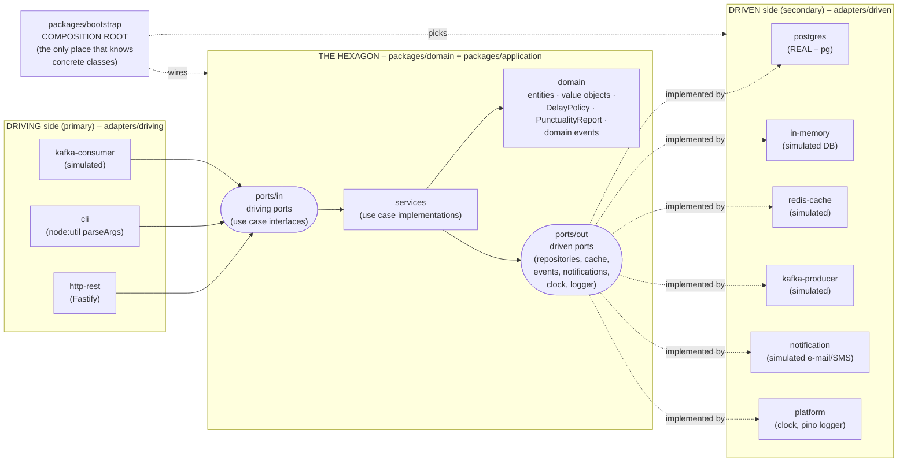

# US Flights – Hexagonal Architecture PoC

Proof of Concept of **Hexagonal Architecture (Ports & Adapters)** with **Node 26 + TypeScript**
in an **npm workspaces monorepo**. It exposes US airports, delayed flights and punctuality
statistics from the `usflights` PostgreSQL database, and simulates Kafka, Redis, an alternative
database and a notification gateway to show how every kind of port/adapter is built.

- No build step: Node 26 runs `.ts` natively (type stripping). `tsc` is used only to type-check.
- Runtime dependencies: `fastify`, `pg`, `pino`. Nothing else.
- Tested with the built-in `node:test` following the test pyramid:
  **see [README_testing.md](./README_testing.md)**.

---

## 1. The hexagon



### Boundary rules (enforced by each workspace's `package.json` dependencies)

| Package | Layer | May depend on |
|---|---|---|
| `packages/domain` | inside | **nothing** |
| `packages/application` | inside | `domain` |
| `adapters/driving/*` | outside, driving | `application` (driving **ports** only) |
| `adapters/driven/*` | outside, driven | `application` (driven **ports**), `domain` (to build entities), their tech lib |
| `packages/fake-kafka` | outside, infrastructure | nothing (it plays the role of a Kafka cluster) |
| `packages/bootstrap` | composition root | hexagon + driven adapters |
| `apps/*` | entry points | bootstrap + driving adapters |

Dependencies always point **inwards**. The domain and application never import `pg`, `fastify`,
`pino` or any adapter. Every file starts with a `// HEXAGON: inside | boundary | outside` tag.

## 2. Repository layout

```
proof_of_concept/
├─ db/                              SQL scripts (database already running)
├─ packages/
│  ├─ domain/                       INSIDE   entities, value objects, policy, domain service, events
│  ├─ application/                  INSIDE   ports/in, ports/out, services (use cases), views
│  ├─ bootstrap/                    COMPOSITION ROOT   config + manual DI container
│  └─ fake-kafka/                   INFRA    in-process broker standing in for Kafka
├─ adapters/
│  ├─ driving/
│  │  ├─ http-rest/                 REST API (Fastify)
│  │  ├─ cli/                       command line
│  │  └─ kafka-consumer/            consumes `flight-status`, DLQ on failure
│  └─ driven/
│     ├─ postgres/                  REAL PostgreSQL repositories
│     ├─ in-memory/                 simulated DB, same repository ports
│     ├─ redis-cache/               simulated Redis (CachePort)
│     ├─ kafka-producer/            publishes domain events to `flight-delays`
│     ├─ notification/              simulated e-mail / SMS gateway
│     └─ platform/                  SystemClock (ClockPort), pino (LoggerPort)
└─ apps/
   ├─ api/                          REST + Kafka consumer + airline-feed simulator
   └─ cli/                          CLI entry point
```

## 3. Ports catalogue

**Driving ports** (`packages/application/src/ports/in`)

| Port | Driven by |
|---|---|
| `ListAirportsUseCase`, `GetAirportUseCase`, `GetAirportDelayStatsUseCase` | HTTP, CLI |
| `FindDelayedFlightsUseCase` | HTTP, CLI |
| `ListCarriersUseCase`, `GetCarrierPunctualityRankingUseCase` | HTTP, CLI |
| `ProcessFlightStatusUseCase` (command) | Kafka consumer |

**Driven ports** (`packages/application/src/ports/out`)

| Port | Adapter(s) |
|---|---|
| `AirportRepository`, `CarrierRepository`, `FlightRepository` | `postgres` (real), `in-memory` (simulated) |
| `CachePort` | `redis-cache` (simulated) |
| `EventPublisherPort` | `kafka-producer` (simulated) |
| `NotificationPort` | `notification` (simulated) |
| `ClockPort`, `LoggerPort` | `platform` |

## 4. Running it

Prerequisites: Node ≥ 26 (`fnm use 26`), and PostgreSQL on `localhost:5432` with the `usflights` DB.

```bash
npm install
cp .env.example .env        # then set PGPASSWORD in .env
npm run typecheck

npm start                   # REST API on http://127.0.0.1:3000 using PostgreSQL
npm run start:memory        # same API, in-memory driven adapter – no database needed
npm run dev                 # node --watch

npm test                    # unit + integration (PostgreSQL tests auto-skip without PGPASSWORD)
npm run test:all            # unit → integration → end-to-end
```

The test strategy, and the reasoning for where each test lives, is explained in
[README_testing.md](./README_testing.md).

### REST API (`/api/v1`)

| Endpoint | Description |
|---|---|
| `GET /health` | liveness |
| `GET /api/v1/airports?state=TX&city=&q=&limit=&offset=` | search US airports |
| `GET /api/v1/airports/:iata` | one airport |
| `GET /api/v1/airports/:iata/delay-stats` | departures/arrivals punctuality (cached in simulated Redis) |
| `GET /api/v1/flights/delayed?minDelay=60&origin=&dest=&carrier=&year=` | delayed flights, worst first |
| `GET /api/v1/carriers?q=delta` | carriers |
| `GET /api/v1/carriers/punctuality?year=2005&minFlights=10&limit=10` | carrier ranking (cached) |

```bash
curl 'localhost:3000/api/v1/airports?state=TX&limit=5'
curl 'localhost:3000/api/v1/airports/JFK/delay-stats'      # call twice → "[SIMULATED REDIS] GET hit"
curl 'localhost:3000/api/v1/flights/delayed?minDelay=120&origin=ORD'
curl 'localhost:3000/api/v1/carriers/punctuality?limit=5'
curl 'localhost:3000/api/v1/flights/delayed?minDelay=5'    # 400: below DelayPolicy threshold
```

Errors are returned as `application/problem+json` (RFC 9457). The HTTP adapter maps
`ValidationError → 400` and `NotFoundError → 404`. The hexagon knows nothing about HTTP.

### Event-driven flow (simulated Kafka)

```
airline-ops simulator ──► topic flight-status ──► [driving] FlightStatusKafkaConsumer
     (apps/api)                                         │ translate external contract → command
                                                        ▼
                                            ProcessFlightStatusUseCase ──► DelayPolicy (domain)
                                                        │ delayed?
                                  ┌─────────────────────┴───────────────────┐
                                  ▼                                         ▼
                   [driven] KafkaEventPublisher               [driven] SimulatedNotificationGateway
                        topic flight-delays                          e-mail / SMS (logged)

  invalid / unknown airport / malformed JSON ──► topic flight-status.dlq
```

```bash
# delayed flight → FlightDelayDetected on `flight-delays` + e-mail and SMS notifications
curl -X POST localhost:3000/simulate/flight-status -H 'content-type: application/json' \
  -d '{"airline":"DL","flight":"1234","from":"ATL","to":"JFK","delayMinutes":72,"delayReasons":["WEATHER"]}'

# on time → processed, nothing published
curl -X POST localhost:3000/simulate/flight-status -H 'content-type: application/json' -d '{"delayMinutes":5}'

# unknown airport / malformed payload → dead-letter queue
curl -X POST localhost:3000/simulate/flight-status -H 'content-type: application/json' -d '{"from":"ZZZ"}'
curl -X POST localhost:3000/simulate/flight-status -H 'content-type: application/json' -d '{"rawValue":"oops"}'

curl localhost:3000/simulate/topics
curl localhost:3000/simulate/topics/flight-delays
curl localhost:3000/simulate/topics/flight-status.dlq
```

`/simulate/*` is **not** part of the application. It plays the outside world (the airline
feed, plus a `kafka-console-consumer`) and lives in `apps/api`, outside every adapter.

### CLI – a second driving adapter on the same ports

```bash
npm run cli -- airports --state TX --limit 5
npm run cli -- airport JFK
npm run cli -- stats LAX
npm run cli -- delayed --min 120 --origin ORD
npm run cli -- ranking --year 2005 --limit 5
npm run cli -- carriers --q air --json
npm run cli:memory -- ranking                  # same command, in-memory adapter
```

Exit codes: `0` ok, `2` usage/validation error, `3` not found, `1` unexpected failure.

## 5. Configuration (`.env`)

| Variable | Default | Purpose |
|---|---|---|
| `PERSISTENCE` | `postgres` | `postgres` or `memory`: selects the driven persistence adapter |
| `PGHOST` `PGPORT` `PGDATABASE` `PGUSER` | `localhost` `5432` `usflights` `postgres` | PostgreSQL |
| `PGPASSWORD` | – (required for postgres) | never hardcoded |
| `HTTP_HOST` `HTTP_PORT` | `127.0.0.1` `3000` | the API has no auth: keep it on loopback |
| `DELAY_THRESHOLD_MIN` | `15` | domain `DelayPolicy` (FAA: delayed ≥ 15 min) |
| `CACHE_TTL_SECONDS` | `60` | simulated Redis TTL |
| `OPS_RECIPIENTS` | `ops@usflights.example,+1-555-0100` | notification targets (`@` = e-mail, else SMS) |
| `LOG_LEVEL` | `info` | pino level |

## 6. Design notes 

- **The live DB differs from `db/createUSFlightsSchema.sql`.** The column is `dayofmonths`, and the
  delay-cause columns (`carrierdelay`…) are **booleans**, not minutes. That knowledge is
  isolated in `adapters/driven/postgres/src/mappers.ts`. The domain uses `Flight.date` and
  `Flight.delayCauses`, which is an anti-corruption layer in practice.
- **Who decides what "delayed" means?** `DelayPolicy` in the domain. Repositories receive
  the policy, so SQL (`arrdelay >= $1`) and the in-memory filter apply the *same* rule.
- **Aggregation vs. interpretation.** The DB counts rows (cheap, close to the data).
  `PunctualityReport` / `rankByPunctuality` (domain) compute on-time rates and ranking.
- **Use cases return views, not entities.** Driving adapters can't reach into the domain, and
  views are JSON-serializable, so they can be cached through `CachePort`.
- **Validation lives in the hexagon.** HTTP JSON schemas only check types. Business validation
  (IATA format, threshold, pagination limits) happens in value objects and use cases, so the CLI
  and the Kafka consumer get it for free.
- **External contracts are translated at the edge.** The Kafka message (`airline`, `from`,
  `schedArr`…) is not the application command (`carrier`, `origin`, `scheduledArrival`…).
- **Errors map per protocol.** HTTP uses status codes, the CLI uses exit codes, Kafka uses the DLQ.
- **Swapping infrastructure.** `PERSISTENCE=memory` changes one branch in
  `packages/bootstrap/src/container.ts`. Not a single line inside the hexagon changes.
  Replacing a simulated adapter (Redis, Kafka) with a real one means rewriting that adapter only.
- **SQL safety.** All values are bind parameters. Column names that vary (`origin`/`dest`) come
  from a fixed whitelist. `ILIKE` patterns escape `%` and `_`.
- **Where is the Hexagon?**  The hexagon is two directories:

```
proof_of_concept/
└─ packages/
├─ domain/src/          ← the core of the hexagon
└─ application/src/     ← use cases + ports; its port folders are the hexagon's edge
```

    packages/domain/src/ is the business core. It has no dependencies on anything.
    - entities/: Airport, Carrier, Flight
    - value-objects/: IataCode, CarrierCode, Delay, FlightDate
    - policies/: DelayPolicy, which defines "delayed"
    - services/: PunctualityReport and the ranking logic
    - events/: FlightDelayDetected
    - errors.ts

    packages/application/src/ holds the use cases. It depends only on domain.
    - services/: the use-case implementations
    - shared/: input parsing and pagination
    - views.ts: the read models returned to callers
    - ports/in/: the use-case interfaces that driving adapters (REST, CLI, Kafka consumer) call
    - ports/out/: the interfaces that driven adapters (Postgres, cache, Kafka producer, etc.) implement

  - The two ports/ folders are the boundary itself: they're defined inside the hexagon, but they're the only things the outside world touches.
  - Two kinds of file sit inside those folders without being part of the hexagon:
      - packages/application/src/testing/ is test support. It's exposed as a separate @usflights/application/testing entry point and never imported by production code.
        - *.test.ts files sit next to the code they test.

## 7. Testing

217 tests organised as a test pyramid (unit → integration/contract → end-to-end), co-located
with the code they test. Full explanation: **[README_testing.md](./README_testing.md)**.

## 8. Not done yet

- Architecture fitness checks (e.g. dependency-cruiser) to fail CI when a boundary is crossed.
